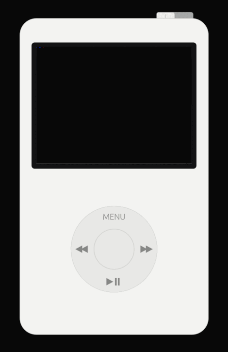
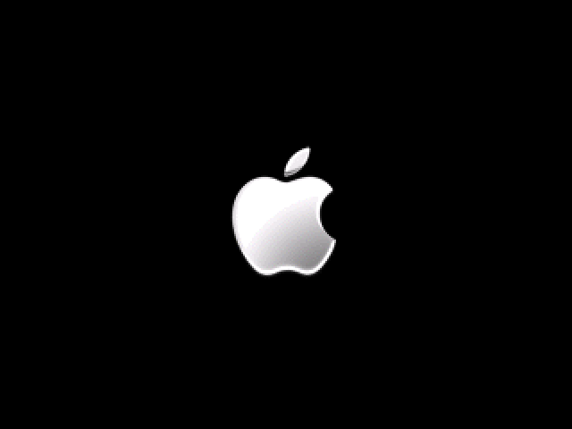
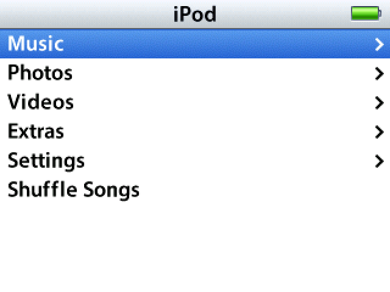
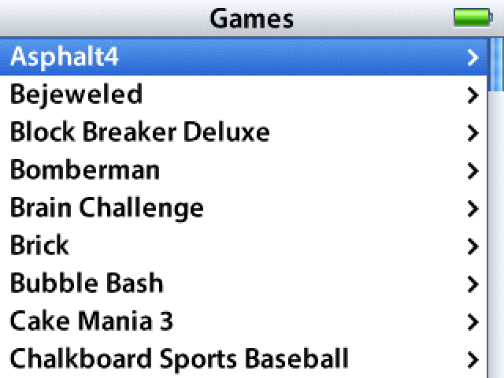
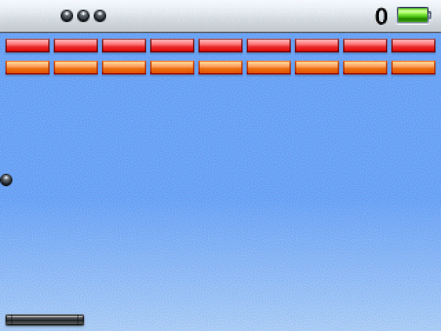
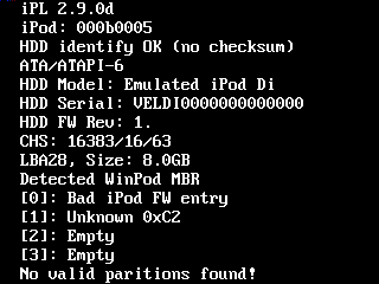
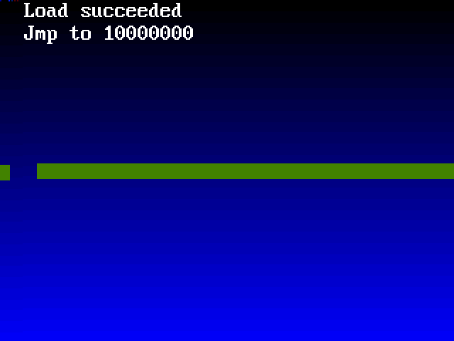
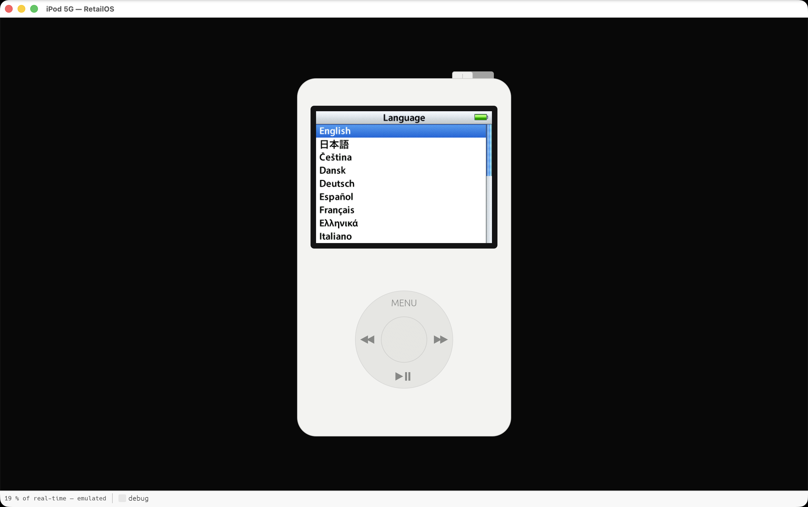
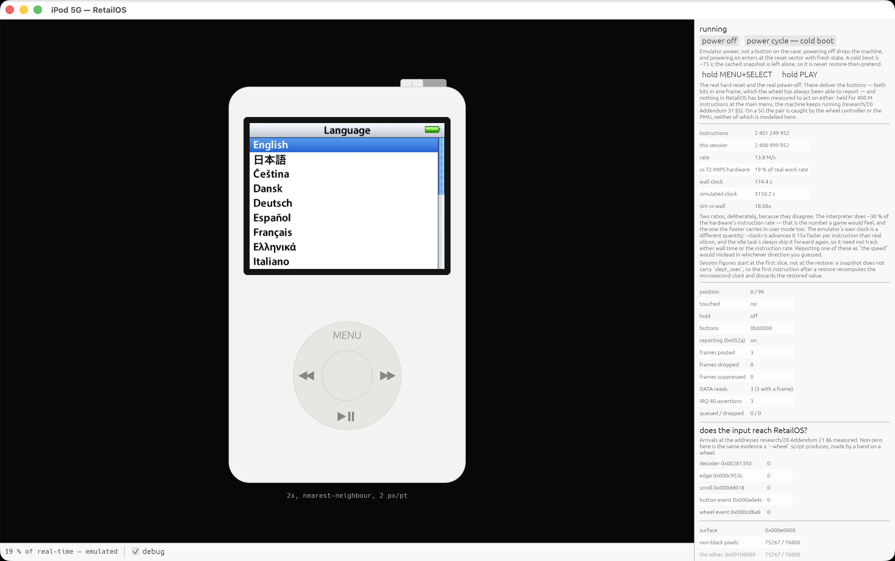

# ipod-emulator

**Apple's iPod Video firmware boots here, from the reset vector, on an emulator written from
scratch.** It formats its own filesystem, reads the click wheel, draws its own menus, and plays a
game. So does Rockbox.

> **Alpha.** It boots, it draws, it plays Brick — with one pair of images behind it. Expect rough
> edges, and expect things that work here to fail on files nobody has tested.
> **[Open an issue](https://github.com/siggifly/ipod-emulator/issues)** if something breaks; every
> report so far has found a real bug.

## Quick start

**You do not need an iPod, or any files off one.**

1. **Get the app.** Download a [release](https://github.com/siggifly/ipod-emulator/releases), unpack
   it, and open `ipod-emulator.app` (macOS) or run `ipod-emulator` (Linux, Windows).
2. **Press the button.** It synthesises a boot ROM and downloads Apple's firmware itself — then
   builds a drive from it and boots.

That is the whole of it. The ROM is built from a table of **198 iPods** transcribed from libgpod, so
the machine carries a real model number, serial and GUID, generated from a seed so the same iPod
comes back next launch. The firmware comes from **Apple's own servers** — 66 of the 71 releases are
still served, every one verified against a recorded size and SHA-256, and nothing is renamed into
place until it verifies.

This is what a synthesised iPod shows while it starts:

**It is not code-signed** — deliberately, because buying a certificate to make a
reverse-engineering tool look official is the wrong trade. macOS 15+ blocks the first launch: open
it, then **System Settings → Privacy & Security** has a button to open it anyway. Windows:
**More info → Run anyway**. Anything you build yourself skips this.

### Bringing your own files

**The two halves are independent.** The boot ROM and the drive are separate questions, and you can
supply either, both or neither — drop whatever you have anywhere on the window, in any order. Each
file is identified by what it *contains*, not by which box you put it in.

**It keeps them all.** Everything you drop is filed in Resources — boot ROMs, `.ipsw` bundles,
drives — and a **device** is a name for one selection from it. So a second boot ROM does not replace
the first, one ROM can back several devices, and switching between two iPods is pressing start on
one of them rather than finding two files again.

| the boot ROM | the drive |
|---|---|
| **synthesised** — no file needed | **built from a fetched `.ipsw`** — no file needed |
| **your own 1 MB NOR dump** | **your own `.ipsw`**, built into a drive as it lands |
| | **a drive image you already have** — then no `.ipsw` is needed at all |

Any combination works. What a *real* dump additionally buys you is the things that **are** the ROM
and cannot be synthesised: **Apple's own bootloader** running from the reset vector, and the
**service diagnostics** below.

You can also give a synthesised iPod **your own boot picture** in place of the click-wheel outline —
it is a path in the settings, re-read when you edit the file.

Reading a dump off your own iPod takes about five minutes with Rockbox and undoes cleanly:
**[docs/GETTING-THE-FILES.md](docs/GETTING-THE-FILES.md)**.

## What it runs

**Apple's own code the whole way.** The bootloader brings up SDRAM, talks to the PCF50605 power chip
over I²C, uploads firmware to the video co-processor, DMAs 7.5 MB of RetailOS into memory, checksums
it and jumps. RetailOS starts its RTXC kernel and 61 tasks, formats its own FAT32 volume, and draws.

| | |
|---|---|
|  |  |
|  |  |

**Two bootloaders and two operating systems in the window** — Apple's and Rockbox's; RetailOS and
Rockbox 4.0, each unmodified, from upstream, fetched and verified by this program, installed onto a
drive it wrote and started by Apple's own bootloader.

**A third of each runs, and is not offered in the window yet.** `ipodloader2` and iPodLinux are
**experimental**: the install is complete and the kernel boot is clean, and then ZeroLauncher stalls
at its last step. `ipod-boot install-linux` builds that drive for anyone who wants to look at it —
the window does not offer a path that ends there after a 101 MB download. See
[KNOWN-BUGS.md](KNOWN-BUGS.md).

| Rockbox 4.0 — its main menu | `ipodloader2` — reading the drive | iPodLinux — its userland starting |
|---|---|---|
|  |  |  |

*The right two are the experimental pair, reached with `ipod-boot install-linux`.*

**Rockbox is finished; iPodLinux is not, which is why the window does not offer it.** Its kernel
boot is clean — both partitions found, FAT32 root mounted, `/bin/init` run, ZeroSlackr's ext3
userland loop-mounted, and no ATA error anywhere in the dmesg. Then ZeroLauncher draws the screen
above and **stalls at its last step**. The picture is there because it is what actually happens, not
because it is finished.

`ipod-boot install-linux` builds the drive: the loader into the firmware partition, ZeroSlackr's five
directories onto the volume, and a boot menu naming only what is actually on it. On a drive that
already has Rockbox, that is a three-entry menu — **ZeroSlackr, Apple OS, Rockbox.**

**And Apple's service diagnostics** — the program a real iPod shows on `SELECT`+`REW` at power-on.
It lives *inside* the boot ROM, so this one **needs a real dump**; a synthesised ROM has no image
directory to hold it:

## The window

A drawn iPod whose screen is the live framebuffer and whose wheel, buttons and hold switch drive the
machine. `D` overlays a readout; `S` writes a screenshot; `Esc` leaves a screen.

| user mode | with the readout |
|---|---|
|  |  |

**Power off and restart are real** — the machine is dropped and re-entered at the reset vector, not
restored and pretended. By default the iPod writes to your drive image, exactly as a real one writes
to its own disk, and closing the window parks it so the next launch resumes in three seconds instead
of cold-booting for seventy-five. **Work on a copy** in settings never touches your image.

## What it does not do

- **No audio.** The Wolfson codec is unmodelled.
- **No USB** — so no target disk mode and no restore.
- **~24 % of real time** headless — about 17.4 M instructions/sec against a 72 MHz PP5021C,
  simulating *both* of its cores. One core alone runs at 18.8 M, so the second costs 7 %: it used to
  cost 24 %, because it was awake and spinning for entire boots (see CHANGELOG 0.5.0). Idle costs
  about the same as busy, so the ratio holds whatever the iPod is doing.

## Where to look next

One document per question, and none of them answers another's.

| | |
|---|---|
| [**docs/DEVELOPING.md**](docs/DEVELOPING.md) | building it, the command-line recipes, installing other operating systems |
| [ROADMAP.md](ROADMAP.md) | what is *intended*, in what order — including the per-subsystem **Where we are** table |
| [KNOWN-BUGS.md](KNOWN-BUGS.md) | what is *wrong* |
| [research/04-bypass-ledger.md](research/04-bypass-ledger.md) | what is *faked*, with a retirement condition for each |
| [CHANGELOG.md](CHANGELOG.md) | what *changed*, release by release |
| [NEXT.md](NEXT.md) | what is being worked on *now* |
| [research/17](research/17-the-boot-matrix.md) | **the boot matrix** — which OS boots on which ROM, cell by cell |
| [research/](research/) | how any of it was found out — the larger half of this project |

`research/` keeps what was believed and why it was wrong, in place, rather than tidying it away.
Several conclusions in it are retracted by later ones and the retraction sits next to the claim.

## Contributing

Development happens in a small group, and **it starts on Discord** rather than with a pull
request:

> **https://discord.gg/MSqmeWy2nX**

That is deliberate and not gatekeeping for its own sake. Much of the work needs Apple's
firmware, ROM dumps and multi-gigabyte disk images that cannot be published — so a
contributor needs the files, the context for what has already been tried, and somewhere to
ask before spending a weekend re-deriving something. A pull request arriving cold has none
of that, and the reviewer cannot supply it in a comment thread.

So: say hello, say what interests you, and you will be pointed at the working repository and
the guide that goes with it. Bug reports and questions are welcome as issues here without
any of that.

**The link above is the only copy of it in this project.** If you find it written down
anywhere else, that copy is the one that will go stale.

## Credit

Other people's work made this possible, and some of it saved months. In rough order of debt:

- **[Rockbox](https://git.rockbox.org/)** — by a distance. `pp5020.h` and the iPod target code are
  where most register semantics came from, and Rockbox was the *oracle*: a known-good OS to boot
  when something broke and you needed to know whether it was you. If you want to understand this
  hardware, read Rockbox first.
- **[iPodLinux](http://www.ipodlinux.org/)** — the older layer beneath it, and still the only source
  for the MMAP window encoding and the `sysinfo_t` layout.
- **`dreamlayers`**, on the Rockbox forums in **2009**, who identified `vmcs.bin` and the `.vll`
  files as ELF DLLs loaded into the Broadcom chip. This project worked that out independently in
  2026 and then found the post. Sixteen years early.
- **[Olsro's Clickwheel Games Preservation Project](https://github.com/Olsro/ipodclickwheelgamespreservationproject)**
  — the reason this project exists at all.
- **[daniel5151/clicky](https://github.com/daniel5151/clicky)** — independently needed the same two
  undocumented register bits, found by a different method on a different SoC revision.
- **[freemyipod](https://freemyipod.org/)** and q3k's [wInd3x](https://github.com/freemyipod/wInd3x)
  writeup — different silicon, but the *oracle test* is a method this project stole outright.
- **[devos50/qemu-ios](https://github.com/devos50/qemu-ios)** ·
  **[giek2000](https://github.com/giek2000/ipod-classic-firmware-research)** ·
  **[Xlinka](https://github.com/Xlinka/iPodReverseEngineering)** ·
  **[dstaley/ipod-sysinfo](https://github.com/dstaley/ipod-sysinfo)** ·
  **[raspberrypi/userland](https://github.com/raspberrypi/userland)** ·
  **[theapplewiki](https://theapplewiki.com/)** · **[Ghidra](https://ghidra-sre.org/)**.
- **Broadcom**, for leaving the BCM2722 brief public; **Alphamosaic**, whose patents disclose
  VideoCore; **EE Times**, whose teardown report is the only published bill of materials for this
  board.

**If you want to give something back, give it to them.** Rockbox has been maintained for twenty
years by people who documented this hardware so anyone could use it, before there was an LLM to do
the typing. If you still want to throw something at this one:
**[ko-fi.com/siggifly](https://ko-fi.com/siggifly)** — it goes on parts for **oPod**, the open player
this is meant to run on when the hardware runs out.

## Who wrote this

**I did not write a single line of code in this project.** It was written with Claude Opus 5 under
direction. What I did was steer: decide what was worth chasing, push back when an answer sounded too
convenient, find the prior art that unstuck it, and say "that can't be right, look again". That is
not nothing, and it is also not writing an emulator. I would rather say so than let anyone assume
otherwise.

Part of the iPod Preservation Project — other arms are running games without RetailOS at all,
presenting a virtual iPod to iTunes, and **oPod**.

## Licence

GPL-3.0-or-later for the code, CC BY-SA 4.0 for `research/`. See [docs/LICENSING.md](docs/LICENSING.md).
Apple's firmware, NOR dumps, IPSW files and disk images are not covered, not distributed, and never
will be.
