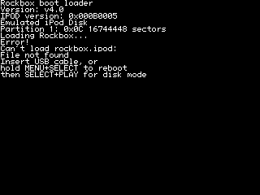

# Rockbox as an oracle

**RetailOS is stripped C++ with no symbols. Rockbox drives the same PP5022 hardware, is open
source, and ships an ELF with 5 808 symbols.** Running it on this emulator converts every
divergence from *"a hex address in a binary we cannot read"* into *"a function name and a line of
source"*.

This was the strategic answer to a night spent generating and killing hypotheses one at a time. The
bottleneck was never measurement — the instruments are good — it was that **every measurement landed
in a binary with no ground truth**.

## It works, first attempt

`tools/ipod-boot/rockbox.sh` warm-enters `rockbox.ipod` at `0x10000000`. Rockbox runs **913 611
instructions** and executes **93 854 distinct code buckets** — against RetailOS's 19 660 in a run
sixteen times longer.

And when it stops, the profile says this:

```
0x00000270   47.0%   cpu_init+0x88
0x00000240    8.0%   cpu_init+0x58
0x00000250    1.5%   cpu_init+0x68
```

**That is the entire point.** `cpu_init` is in `firmware/target/arm/pp/crt0-pp.S`, we have the file,
and `+0x88` lands in the BSS-zeroing loop with `+0x58` in the `.init` copy — ordinary startup work,
which is what 913 K instructions of a booting OS should look like.

## What it has already validated about our emulator

Each of these was previously an assumption:

| thing | evidence |
|---|---|
| **The MMAP model is right** | Rockbox programs the remap itself (`remap_start` in `crt0-pp.S`, `MMAP_LOG`/`MMAP_MASK`/`MMAP_PHYS`) and then keeps executing. §33's decode holds up against a second, independent implementation |
| **Bypass #7 (COP asleep) is adequate** | `cpu_init` opens with `ldr r3,[r4]; tst r3,#COPSLEEPING; beq 1b` — a hard spin until the coprocessor reports sleeping. Rockbox passes it, and the spin does **not** appear in the profile |
| **The relocation/alias layout is right** | Memory at `0x03e80520` after the run is byte-identical to the image file at `0xa932c+0x520`. The `.init` copy to the codec buffer landed exactly |
| **BSS reclaim behaves as documented** | `0x000a932c` reads zeros afterwards — the `.init` source region is reclaimed, exactly as `crt0-pp.S` says it is |

## Where Rockbox currently stops

Execution runs off the end of the `.init` section — `_initstart` = `0x03e80000`, size `0x11bb8`, so
`_initend` = `0x03e91bb8`, and the last new code is at `0x03e92bb0`, past it, executing zeros until
it falls out of DRAM at `0x04000000`. `r4 = 0xdeadbeef` at the halt is Rockbox's **stack munge
value**, loaded in `crt0-pp.S` right after the copies — so the copies completed and it got past
them.

`main` itself is fine: `0x03e80520` holds `stmdb sp!,{r7,lr} / sub sp,sp,#0x30 / bl …`, matching the
file. So this is not a bad copy. Something inside `.init` falls through instead of branching, and
**that is now a debuggable question**, because every frame has a name.

## The load contract, verified

Both `.ipod` files are an 8-byte wrapper — big-endian checksum + ASCII `ipvd` — over a raw ARM
image (`tools/scramble.c`, `modelnum = 5`; stripped by `firmware/common/rb-loader.c`). Both
checksums were **recomputed and matched**, so the downloads are intact and the format is confirmed
rather than assumed.

- `rockbox.ipod` — linked for address 0 (`app-pp.lds`: `DRAMORIG 0x00000000`, ELF `e_entry = 0`),
  loaded to `DRAM_START` = `0x10000000` and entered there; it remaps SDRAM to 0 itself, detecting
  where it is running with `and r6, pc, #0xff000000`.
- `bootloader-ipodvideo.ipod` — linked at `0x40000000` but **position-independent**: it copies
  itself to IRAM and jumps. Installed by appending to the `osos` image.

## What this confirmed about the identity path

Independently of [research/03](03-rtxc-and-the-video-coprocessor.md) §54, Rockbox names the field:

```c
/* firmware/export/hwcompat.h */
#ifdef IPOD_VIDEO
#ifdef BOOTLOADER
#define IPOD_HW_REVISION (*((unsigned long*)(0x0000405c)))
#else  /* ROM is remapped */
#define IPOD_HW_REVISION (*((unsigned long*)(0x2000405c)))
#endif
```

`0x405c` is `SCfg + 0x5c` — the `HwVr` record's value word, exactly where we found `0x000b0011`.
Generation is `hw_rev >> 16`, confirmed against `ipodloader2`'s `hw_ver` and Rockbox's own
`(IPOD_HW_REVISION >> 16)` comparisons.

**Two honest caveats, carried forward from the acquisition rather than smoothed over:**

- **`0x000B0011` appears in no published table.** The archived iPodLinux "Generations" table lists 5G
  as `0x000B0005` or `0x000B0010`, and never recorded a 5.5G value — its wiki states *"5.5G iPods
  never had a SysInfo file"*. That `0x11` is "the 5.5G" is a **reasonable inference from the next
  board revision, not a sourced fact**. The high half (`0x000B` = iPod Video family) is solid.
- **Our ROM dump is labelled a prototype**, with a dummy serial (`U1234567890`) and a blank `HwId`,
  so the low half may be prototype-specific.

## The one that matters for bypass #6

`lcd-video.c` uploads a **`vmcs` blob to the Broadcom chip**, located through a directory at
`ROM_BASE + 0xffe00` of 10-word entries tagged `flsh`. That directory was parsed in our own dump: 5
sections — `disk`, `diag`, `scan`, `logo`, `vmcs` — **all checksums valid**, with `vmcs` being
101 728 bytes at ROM offset `0x6ec98`.

[research/04](04-bypass-ledger.md) #6's retirement condition has always read *"executing the `vmcs`
firmware"*, and it has always looked like the largest job in the file. **The blob is in the flash we
already have, at a known offset, with a valid checksum, and Rockbox contains readable source for how
it is uploaded.** That is a materially different proposition from writing a VideoCore II emulator
from nothing.

## The first divergence the oracle found

Rockbox falls through the **linker veneer table** at the end of `.init` — `__i2c_readbyte_veneer`,
`__pcf50605_init_veneer`, `__memset_veneer` and the rest, executed one after another in address
order at exactly four instructions per 16-byte bucket. A veneer is `ldr pc, [pc, #-4]` + a target
word; it branches immediately. Walking *through* them means they are zeros.

They are. And this is our bug, not Rockbox's.

### Bounded precisely

| | |
|---|---|
| `.init` runs at | `_initstart = 0x03e80000`, `_initend = 0x03e91bb8` (`0x11bb8` bytes) |
| copied from | `_initcopy = 0x000a932c` |
| **last address with correct data** | `0x03e90c00` (source `0x000b9f2c`) |
| **first address left zero** | `0x03e90d00` (source `0x000ba02c`) |

Everything below the boundary matches the image **byte for byte**, including regions that are
legitimately zero in the file. Everything above is zeros where the file has code.

### What has been ruled out

- **The loop did not exit early.** Breaking at `0x0000024c`, immediately after it, gives
  `r2 = 0x03e91bb8` — exactly `_initend`. Every iteration executed, so every store executed.
- **The source is intact.** `0x000ba02c` and `0x000ba32c` match the image file both *before* the
  copy (`--stop-at=0x23c`) and *after* it. The copy did not clobber its own source.
- **Nothing zeroed the destination afterwards.** The dump is taken at `0x24c`, the instruction after
  the loop. It is already zero there. The BSS (`0x000a6cf0..0x00132960`) and IBSS (IRAM) zeroing
  loops both run *after*, and neither covers `0x03e9xxxx`.
- **Nothing is unmapped.** The access report is empty: `osos-low` and `sdram-low` both at
  `0x00000000`, and `sdram-low` is a full `0x04000000`. The address is mapped and writable.
- **Translation is not splitting it.** MMAP0 reads back `LOGICAL = 0x00003c00`,
  `PHYSICAL = 0x10000f84` — exactly the values `crt0-pp.S` writes (`MMAP_MASK` for the 64 MB part,
  `MMAP_FLAGS | (pc & 0xff000000)`). The `0x13e90c00`/`0x13e90d00` aliases behave identically to the
  low addresses, so both sides of the boundary resolve the same way.

So: the loop ran, the source was good, the destination was mapped and writable, nothing overwrote
it, and roughly the last `0xfb8` bytes of an `0x11bb8`-byte copy did not land. **That is
contradictory, which means one of those five statements is measuring the wrong thing** — and finding
which is the next job.

### Why this is the point of the exercise

This took about an hour from "Rockbox boots" to a divergence bounded to a **256-byte window**, with
the failing mechanism named (`.init` veneers), the correct data available for comparison (the image
file), and the authoritative constants in hand (`crt0-pp.S`).

The equivalent question in RetailOS consumed a night and produced "an unbound delegate at
`record+0x20` that nothing writes", ~~which is still unresolved~~ **which was wrong in its premise —
`+0x20` is written, on all 790 objects of its shape ([research/10](10-the-resource-image.md) §2), and
the delegate is null because a font lookup missed.** Same class of bug; the difference is
entirely that one target has source and symbols.

**Note for whoever picks this up:** `--watch` records *changes*, so it cannot distinguish "wrote 0
over 0" from "never wrote". It reported no writes here and that is not evidence either way. A
write-attempt counter — the shape of the DMA-drop counter added in §51 — is the instrument this
needs.

> **This note aged into the thing it warned about.** The instrument built in answer to it,
> `--watch-range`, carried a *different* blind spot — word-sized writes into a mapped region — and
> went on to produce two more false absences of its own before anyone re-ran the standing claims
> through it (research/09, retracted 2026-08-13; mechanism in research/10 Addendum 8). Writing the
> warning down was not enough, twice. The rule that would have caught it is in `NEXT.md`: a new
> instrument's first job is to re-run the conclusions the old one produced, as a deliberate pass.

## Resolved: a silent data-corruption bug in the emulator's page cache

The five contradictory statements above were contradictory because one of them was measuring the
wrong thing — and `--watch` was not the culprit. `--writelog=BASE:SIZE` was: it records where a store
**lands**, with the PC, the value, and the region that answered.

```
write log: 256 stores recorded, 0 dropped
  -> sdram-low    256
    pc 0x00000244  0x03e90b00 = 0xe3540004  sdram-low
    pc 0x00000244  0x03e90ef0 = 0x00000000  sdram-low
```

**Nothing was dropped. The copy stored zeros because it was handed zeros.** The fault was in the
*reads*, and comparing each stored word against the image file pinned it exactly:

| destination | source | stored | file |
|---|---|---|---|
| `0x03e90c00` | `0x0b9f2c` | `0xe58d3000` | `0xe58d3000` ✓ |
| `0x03e90ef0` | `0x0ba21c` | `0x00000000` | `0xe5d430e8` ✗ |

### The bug

`fast_region` caches a page→region mapping, and required **a whole page to fit inside a region**:

```rust
off < r.data.len() && r.data.len() - off >= PAGE as usize
```

…then used `position(fits)` — so when the correct region could not hold a full page, the search
**continued to the next region that could**. Two regions share base `0`: the firmware image
(`osos-low`, `0xbaee4` bytes) and SDRAM. The image's last partial page, `0xba000..0xbaee4`, cannot
hold 4 KB — so every read there silently fell through to **SDRAM and returned zeros instead of
firmware**.

Predicted boundary `0xba000`; measured last-good source `0x0b9f38`, first-bad `0x0ba21c`. Exact.

Nothing was ever reported unmapped, because **the wrong region answered rather than no region at
all** — which is precisely why five separate checks all came back clean.

The fix makes the fast path agree with the slow one: `locate_idx` takes the *first* region
containing an address, so the cache now picks that region and then decides whether it is cacheable,
never searching past it.

### What it bought

| | before | after |
|---|---|---|
| Rockbox outcome | `Lost(0x04000000)` after 913 K instructions | runs to budget |
| profile buckets | 256 | 2 140 |
| where | `.init` veneers, executing zeros | **`switch_thread`, `corelock_lock/unlock`, `__bitarray_ffs`** |

**Rockbox now boots to its own scheduler.** `lcd_init_device` runs. The kernel is scheduling.

One more thing was needed to get there, and Rockbox named it in C:

```c
/* firmware/target/arm/pp/usb-fw-pp502x.c */
while ((inl(0x70000028) & 0x80) == 0);
```

Bit 7 of `0x70000028` is the USB module's reset-complete signal, polled forever on a machine that
does not model it — 98.2% of the profile sat in `usb_reset_controller+0x6c`. Supplying it is
currently `--rdval=0x70000028=0x80`, which is a bypass of exactly the #1/#2 family, but for the first
time **with the semantics documented in source** rather than inferred from a spin.

### And it names two of our long-standing mysteries

`firmware/export/pp5020.h` is the real register map we have been reconstructing:

```c
#define DEV_INIT2        (*(volatile unsigned long *)(0x70000020))
#define XMB_RAM_CFG      (*(volatile unsigned long *)(0x7000003c))
#define DEV_RS           (*(volatile unsigned long *)(0x60006004))
#define DEV_EN           (*(volatile unsigned long *)(0x6000600c))
```

`0x7000003c` is [research/04](04-bypass-ledger.md) **#2's register**, now sourced rather than
guessed. `0x70000030` — **#1** — is still absent from the header, so that one remains genuinely
undocumented.

### The RetailOS control

Re-run with the fix: **unchanged.** 505 resets, 6 033 profile buckets, same ATA and BCM totals. The
page-cache bug was real and is fixed, and it is **not** RetailOS's blocker. Worth stating plainly,
because a fix this suggestive invites the assumption that it explains everything.

## Rockbox boots to its menu

![the menu] — themed background, icons, sidebar logo, status bar, and Files/Database/Resume
Playback/Settings/Recording/Playlists/Plugins/System/Shortcuts.

Getting there took three fixes, each named by Rockbox itself.

**1. Install its files.** The first boot drew `Installation incomplete` — correct, since the disk had
`iPod_Control` but no `.rockbox`. An APFS clone of the 8 GB image (`cp -c`, instant, zero extra
space), `Virtual: Yes` verified before attaching, `.rockbox` copied in, unmounted.

**2. ATA writes did not exist.** The next boot panicked, and printed why:

```
*PANIC* (4.0)
dc_writeback_callback() - Could not write sector 8908074 (error -53)
```

The model implemented `IDENTIFY`, `READ DMA`, `READ SECTORS` and a few no-ops, and **aborted every
write**. Adding `WRITE DMA` (with the outbound mirror of the `dma_ready` hand-off, since `Ata`
cannot reach `Memory`) moved the error to `-43`.

**3. The 5.5G writes by PIO, not DMA.** `ata.c` composes these as `ret * 10 - n`, so `-53 → -43` is
the inner code moving `-5 → -4`: `wait_for_end_of_transfer`. The iPod Video defines
`MAX_PHYS_SECTOR_SIZE 1024`, so Rockbox does read-modify-write through **PIO** — and the WRITE
command had been added without the data-register path to feed it. With that, the drive finishes its
transfers and Rockbox reaches its menu.

Writes are **opt-in** (`--disk-writable`, default off) so an emulator bug cannot rewrite the one
disk image this project has; `ipod8g.img` hashes identically before and after, and every write went
to the clone.

### What is proven working end to end

CPU · MMAP · timers · interrupts · threading and scheduler · **ATA reads and writes** · **FAT32
read/write** · LCD init · **BCM2722 command protocol and framebuffer** · fonts · icons · theming.

### And what it says about bypass #6

[research/04](04-bypass-ledger.md) #6's retirement condition reads *"executing the `vmcs` firmware"*,
and it has always been described as the largest job in the file. **Rockbox drives this display to a
complete themed UI without `vmcs` ever being executed.** The synthesised replies are evidently
sufficient for real rendering, so #6 is a smaller job than it has been billed as — and the display
is no longer a capability gap.

RetailOS, re-run after every one of these fixes, is **unchanged**: 505 resets, 6 033 profile
buckets. We now have a machine that provably renders, so RetailOS not drawing is RetailOS's own
state rather than a device we lack.

## A self-check for the whole class of bug

The `fast_region` bug was invisible to unmapped-access reporting, to `--watch`, and to four other
checks, because **the wrong region answered rather than no region**. That failure mode is
indistinguishable from *"a field nobody ever wrote"* — which is exactly what RetailOS's blocker
looks like. So the question worth answering is not "is there another one" but "would we know".

`--verify-memory` cross-checks the page cache against the slow path on every access and reports any
disagreement with the PC and both region names.

**Validated against the bug it was built for.** Reintroducing the old `position(fits)` search:

```
verify-memory: 64 DISAGREEMENTS (fast path answered a different region)
  pc 0x00000240  addr 0x000ba000  fast=sdram-low slow=osos-low
```

`0x000ba000` is the predicted boundary to the byte, and `pc 0x00000240` is the `ldrhi r5, [r4], #4`
in Rockbox's `.init` copy. A control that can fire, firing.

**And the result on the real tree:**

| | verdict |
|---|---|
| Rockbox to its menu | **no fast/slow disagreements** |
| RetailOS, 800 M instructions at `--clock=5` | **no fast/slow disagreements** |

So the memory model is self-consistent on both paths, and **RetailOS's blocker is not a
memory-model lie of this class.** That closes off the hypothesis that the unbound delegate at
`record+0x20` is our emulator silently answering from the wrong region — which, after the
`fast_region` bug, was the single most plausible remaining explanation.

It is a negative, and it is worth the run: it removes the last explanation that would have made the
blocker *our* fault rather than RetailOS's state.


## 2026-08-18: Rockbox boots, and two device models were missing

Re-run on the current tree after the resource reorganisation, which had left this script's `FLASH`
default — and `retail-boot.sh`'s `TRACE` default — pointing at paths that no longer existed.

### First result: it draws, and then stops dead

| | |
|---|---|
| budget | 200 M, then 3 000 M |
| result | `BudgetExhausted` both times — no fall out of DRAM, so the `.init` copy bug above stays fixed |
| panel | **22 179 non-black pixels**: the Rockbox logo and `Ver. 4.0` |
| ATA commands | **0** |
| halt | `r15 = 0x0007e888`, and the splash is unchanged from 200 M to 3 000 M |

The map file names it: `0x0007e888` is inside `wmcodec_write` (`0x7e7cc..0x7e900`) with `LR` in
`usb_init_device`. **The map was misleading and the disassembly settled it** — `--dis=0x7e858:0x58`
gives

```
0007e870  ldr r3, [r2, #0x20]     ; r2 = 0x70000000
0007e874  orr r3, r3, #0x80000000 ; INIT_USB
0007e878  str r3, [r2, #0x20]     ; DEV_INIT2 |= INIT_USB
0007e87c  ldr r3, [r2, #0x28]
0007e880  tst r3, #0x80
0007e888  beq 0x0007e87c          ; spin, no timeout
```

which is `usb-fw-pp502x.c:114-116` word for word, including the `|= 0x2`, the `udelay` through
`0x60005000` and `XMB_RAM_CFG |= 0x47A` that follow it. Rockbox was waiting for a **USB clock-ready
bit this emulator had never had a reason to set**, and the previous section's *"Rockbox to its
menu"* could not have been produced by this recipe.

### The fix, and why it is not a bypass

`Xmb::usb_clock` sets bit 7 of `0x70000028` when `INIT_USB` is written to `DEV_INIT2` — modelled as
a *consequence of the enable*, not as a bit that is simply always on, so a driver that forgot to
start the clock would still hang.

**Measured before it was written**, with `--read-count=0x70000028,0x70000020` over a 600 M RetailOS
boot: `0x70000020` is read ten times from five call sites, and **`0x70000028` is read zero times**.
Apple's firmware never looks at this address.

### Second result: it boots

| | before | after |
|---|---|---|
| ATA commands | 0 | **2 393** |
| distinct pictures | 2 | **4** |
| what it draws | splash | splash → `Scanning disk…` → *"Battery empty! RECHARGE! Shutting down…"* |


### The battery message is not the battery

Rockbox's `adc_init` says `adc_battery->channelnum = 0x2; /* ADCVIN1, resistive divider */`, and
the census showed **every one of 25 677 conversions on channel 2** — which this emulator was
answering with the 3 000 mV catch-all for unknown channels, below Rockbox's 3 400 mV danger
threshold. Channel 2 now answers `0x2c0` (4 125 mV) like the other battery inputs, sourced from
that line rather than guessed.

**It did not fix the shutdown, and the control is why we know.** Forcing `--pmu-adc=2=0x3ff` —
5 994 mV, full scale — still prints the same message and still powers off. So the voltage is not
the trigger, the ADC correction stands on its own evidence rather than on having fixed anything,
and the real cause is elsewhere on `shutdown_screen()`'s path. `battery_level_safe()` reads
`voltage_now`, a filtered value the power thread maintains; a shutdown *requested* for some other
reason would print exactly this while that filter is still empty.

Both changes were re-validated against the recipe every number here is measured on. RetailOS at
600 M is **unchanged to the digit**: 27 510 code buckets, 76 800 non-black pixels, `0xc8 READ DMA
x475 · 0x20 READ SECTORS x4 · 0xca WRITE DMA x4 · 0xec IDENTIFY x3 · 0xef SET FEATURES x11`, wheel
reporting ON with 2 `0x052a` commands.

### What is next, and it is bounded

Why a shutdown is requested at all. Rockbox has 5 808 symbols and this is a two-frame window
between `Scanning disk…` and the message — which is the entire argument this file was written to
make.

## 2026-08-18, later: the menu, and a third model shaped around Apple

### It reaches the menu

Fixing the ADC (below) took Rockbox from a splash to its **main menu** — Files, Database, Resume
Playback, Settings, Recording, Playlists, Plugins, System, Shortcuts — drawn through the same
co-processor transport RetailOS uses.


### The ADC completed on transfers, not on time

`_adc_read` (`adc-ipod-pcf.c:50-55`) writes `ADCC1` and reads `ADCS1`/`ADCS2` **immediately**, one
read per conversion, no poll of the ready bit, once per 400 ms. This model completed a conversion
after a countdown of **two read transfers** — which Apple's polling driver satisfies out of its own
poll loop, and Rockbox never does. The countdown went 2 → 1, the next conversion reset it to 2, and
`latch` did not run once in 27 000 conversions. Rockbox read 0 mV and `query_force_shutdown()`
powered the machine off.

A conversion now settles before the host's next transfer. A microsecond deadline was tried first
and is wrong here for a specific reason: **this model's bus costs no simulated time**, so a deadline
in µs is compared against a clock that never advanced for the transaction it was meant to outlast.

RetailOS across the change: **27 510 code buckets, 76 800 non-black pixels, wheel reporting on with
2 commands and 3 frames, same ATA opcode census** — unchanged.

### The shutdown that remains is not a bug

With the ADC fixed, every `sys_poweroff` call comes from **one** site — `handle_auto_poweroff+0xb8`,
the idle-timeout branch, not the battery branch that produced the earlier message.

And the idle timeout is expiring honestly:

```
cpu sleep: 7 526 995 halts, 1 332 504 ms of simulated time skipped
irqs: 7 051 288 asserted, 1 034 209 taken; usec 1 343 170 682
```

**22 simulated minutes, of which 1 332 s was skipped sleep**, inside about 11 s of executed time.
Rockbox reaches its menu, idles, and this emulator fast-forwards the idling — so its 10-minute
idle poweroff arrives on schedule. Rockbox is correct and the emulator is correct; what is missing
is a thumb on the wheel.

### And a thumb on the wheel does not reach it

Driving `--wheel` from just after the menu appears changes nothing: **0 frames posted, 0 word reads
of `CLICKWHEEL_DATA`**, and Rockbox writes `0x7000c104` exactly **once** in a run where RetailOS
re-arms it continuously.

`lib.rs:4801` is why:

```rust
if !w.reporting { w.frames_suppressed += 1; continue; }
```

`reporting` is set by opcode **`0x052a`** — *RetailOS's* way of asking for autonomous frames. Our
click wheel delivers input only to a firmware that speaks that protocol. Rockbox's
`button-clickwheel.c` arms the receiver its own way and is handed silence.

**That is the third model in two days shaped around Apple's driver rather than around the part** —
after the USB clock-ready bit and the ADC. The pattern is now the most reliable bug-finder this
project has: *anywhere a device's behaviour was derived from what RetailOS does, a second stack
finds the seam.*

## 2026-08-18, later still: input, and the file browser on a real volume

Removing the `0x052a` gate (below) let wheel frames reach Rockbox: **78 frames posted, 78 reads of
`CLICKWHEEL_DATA`, 78 with a frame waiting**, and the menu selection moves. `press=select` on
*Files* opens the file browser.

### The empty listing was correct, and here is the control

The browser opened on **nothing**, which looked like a failed mount. It is not. Every entry at the
root of `ipod8g.img` carries the hidden attribute:

| entry | attr | |
|---|---|---|
| `IPOD` | `0x08` | volume label, not a file |
| `SYSTEM~1` | `0x16` | HIDDEN · SYSTEM · DIR |
| `IPOD_C~1` | `0x12` | HIDDEN · DIR |
| `$RECYCLEBIN` | `0x16` | HIDDEN · SYSTEM · DIR |

and `apps/filetree.c:352-356` skips them:

```c
if (*c->dirfilter != SHOW_ALL &&
    ((entry->d_name[0]=='.') || (info.attribute & ATTR_HIDDEN))) {
    continue;
}
```

**The positive control.** On a *copy* of the image, one byte: clear the hidden bit on `IPOD_C~1`
(`0x12` → `0x10`). Same build, same script, same everything else.


The frame goes from 265 non-black pixels to 2 670 and `iPod_Control` is listed and highlighted. So
Rockbox mounts this emulator's FAT32 volume through the emulated ATA controller, walks its
directory, and applies its own filter correctly. An absence that a one-byte change turns into a
presence is a measurement; an absence on its own is not.

*(Partition type was the suspect and is not the cause: our images are FAT32 type `0x0C`, and
`firmware/common/disk.c` normalises to `PARTITION_TYPE_FAT32_LBA` whenever it finds a valid FAT.
`ipodloader2` is the one that only accepts `0x0B`, which matters for M4 and not here.)*

## 2026-08-18: installed, and cold-booted by Apple's own bootloader

`ipod-boot install-os SRC.img OS.ipod OUT.img` writes an operating system into a **new** drive
image's firmware partition, the way `ipodpatcher` does on hardware: append after `osos`, point the
directory's `entryOffset` at it, fix the checksum, shift the later images out of the way. Nothing
new boots — the machine's real cold path finds it at the address it already looks at, so this is
not a seventh bypass.

**And it works:**



```
Rockbox boot loader          Version: v4.0
IPOD version: 0x000B0005
Emulated iPod Disk
Partition 1: 0x0C 16744448 sectors
Loading Rockbox...
Error!  Can't load rockbox.ipod: File not found
```

Read that as a report on *us*. It found the ROM's hardware revision (`0x000B0005`, the value in our
NOR dump), read our ATA IDENTIFY string back (`Emulated iPod Disk`), and parsed our partition table
— **type `0x0C`, accepted**. Then it looked for `/.rockbox/rockbox.ipod` on the FAT32 volume and
correctly reported that it is not there, because it is not.

### The first attempt produced an image the bootloader rejected, and the fix is worth recording

It booted to *"Connect to your computer. Use iTunes to restore."* after **71 ATA commands** —
against 637 for the unmodified image through the same recipe, which is the control that made it
attributable.

The cause: **image data begins one sector past the partition; the directory does not.**
`ipodpatcher.c:1586` sets `fwoffset = start + sector_size`, and `diroffset` is relative to `start`.
Writing both at the partition base put every byte 512 short.

It is measurable rather than a matter of reading the C: in a stock image, **both** recorded
checksums match a byte sum over `[devOffset + 512, +len)` and **neither** matches one over
`[devOffset, +len)`.

```
osos: recorded 0x2c7c48f3 · sum[dev,+len) = 0x2c7d4460 · sum[dev+512,+len) = 0x2c7c48f3
rsrc: recorded 0x18319bab · sum[dev,+len) = 0x1832856f · sum[dev+512,+len) = 0x18319bab
```

So the installer now **reproduces the checksums that are already there before writing new ones**,
and refuses if it cannot. That check fails on a file nobody has modified, in a second, instead of
producing a plausible image that dies seventy ATA commands into a boot. Both behaviours are tested.

## 2026-08-18: the whole chain, from Apple's reset vector to Rockbox's own binary

`ipod-boot put-files DISK.img SRC_DIR` writes a directory tree into the drive image's FAT32
volume — the other half of an install, and the half the Rockbox bootloader was asking for when it
said *"Can't load rockbox.ipod: File not found"*. 381 files, 19.3 MB, in 1.7 s; an independent
reader (`tools/fat-read.py`) sees all 404 entries with their long names intact.

**Every link now runs:**

```
Apple's boot ROM  →  Apple's bootloader  →  the Rockbox bootloader we installed into the
firmware partition  →  rockbox.ipod, loaded from the FAT32 volume we wrote  →  Rockbox
```


The splash appears at ~110 M instructions and holds for 15 M. Nothing here is warm-entered and no
step is skipped.

### And then it powers off — from a *different* branch than the warm path does

Bounded precisely, which is the useful part:

| | warm-entered (`rockbox.sh`) | cold-booted from disk |
|---|---|---|
| draws | splash → `Scanning disk…` → **menu** | splash, then black |
| `sys_poweroff` callers | all `handle_auto_poweroff+0xb8` — the **idle** branch | all `+0x64` — the **`query_force_shutdown`** branch |
| `power_off()` | — | **230 calls** (it cannot actually power off, so it loops) |

So the cold path fails a battery check that the warm path passes, with the same ADC model and the
same `--pmu` flag in both recipes.

**What has been ruled out**, each by measurement rather than reasoning:

- *The firmware partition was damaged by the FAT writes.* No — both directory checksums still
  reproduce exactly after `put-files`.
- *Wheel input would keep it alive.* No — 124 frames delivered from during the splash, 117 reads of
  `CLICKWHEEL_DATA`, and it still blanks at the same instruction count.
- *A `battery_levels.cfg` in the installed tree moved the thresholds.* No — the Rockbox 4.0 build
  contains no such file.
- *The ADC answers badly.* Channel 2 returns `0x2c0` (4 125 mV) here as everywhere.

The ADC census is itself the next clue: **9 237 conversions on channel 0 and exactly one on
channel 2**. Channel 0 is Apple's bootloader polling before the handoff; one conversion on Rockbox's
own channel means it shut down before its power thread ever ran a second time — so `voltage_now` is
being decided by a single early reading, or by nothing at all.

### Narrowing the cold-boot shutdown: the reading is zero, not low

Both addresses read straight out of the code rather than guessed, by disassembling
`query_force_shutdown` at `0x00068358`:

```
0006835c  bl 0x00068340          ; power_input_present() -- early out if true
0006836c  ldr r3, =0x000a6ba8    ; &battery_level_shutoff (u16)
00068374  ldr r3, =0x000e23b8
00068378  ldr r3, [r3, #0xfc]    ; voltage_now  ->  0x000e24b4
0006837c  cmp r3, r0
00068384  movlt r0, #1           ; voltage_now < shutoff  =>  force shutdown
```

Watching `voltage_now` separates the two paths immediately. Same store, same code
(`0x000687e4`), 300 M instructions:

| | `r0` (filter accumulator) | `r3` (new `voltage_now`) | decay per step |
|---|---|---|---|
| **warm** | `0x00080f7e` | `0x101d` = **4 125 mV** | −1 |
| **cold** | `0x000000fe` | **0** | −0x20 = −32 mV |

So the cold path's battery reading is **zero, not merely low**, and the exponential filter walks
4 160 → 3 300 in about twenty-seven power-thread iterations. That is the shutdown.

**Two more explanations eliminated, both by measurement:**

- *The ADC result registers.* `--pmu-force=0x30=0xb0 --pmu-force=0x31=0x80` rescues the **warm**
  path (it is what first produced the menu) and does **nothing** in the cold one — 315
  `sys_poweroff` calls with the force applied. So the failure is upstream of those registers.
- *The I²C bus never going idle.* `pp_i2c_wait_not_busy` (`i2c-pp.c:55`) gives up after `HZ` ticks
  and `_adc_read` does not check the result, which would leave `data[2]` as stack garbage — a very
  good story. It is wrong: `--watch=0x7000c01c` reports **no writes at all** in either path, so
  `I2C_STATUS` reads 0, `I2C_BUSY` is clear, and the wait returns on its first look. (Consistent
  with that address sitting in the *both* column of [research/15](15-the-register-agreement-table.md)
  — a pure input we invent.)

**Where it stands.** The census records exactly **one** channel-2 conversion in the cold path
against 9 237 on channel 0 (Apple's bootloader, before the handoff). One conversion means
`adc->data` is populated once by `adc_init`'s own `_adc_read` and cached from then on — so a single
early read returning zero would explain every later number. The next measurement is to catch that
one transaction and record the bytes it actually received.

### The cold-boot shutdown, narrowed to the I²C response path

`adc_read(ADC_BATTERY)` returns **`0x2c0` warm and `0` cold** — caught at `0x0007e228`, the
instruction after `_battery_voltage`'s call to `adc_read` at `0x000836e8`. Everything below follows
from separating that one value.

**The disk is not the variable.** Same instrument, three runs:

| | raw ADC value |
|---|---|
| warm + stock drive | `0x2c0` |
| warm + the drive with Rockbox installed | `0x2c0` |
| **cold** + the same installed drive | **`0`** |

So it is the boot path — state Apple's bootloader leaves behind — and nothing to do with the files
we wrote.

**Four more explanations eliminated, each by measurement:**

- *`adc_init` never ran, so `channelnum` stayed at its BSS zero.* No — `--break=0x03e9131c` hits
  **exactly once in both paths**.
- *Rockbox converts the wrong channel.* **It does — but not by asking for the wrong one.** The
  original text read this off `order (first 12 of N kept)`, which is a 4 096-capped sample of the
  *whole run* and cannot attribute anything to the second stack; that reasoning was unsound and is
  replaced below. The measured answer needed a control run, and it is that **9 235 of the cold
  path's conversions are Rockbox's and land on channel 0** — while the guest asks for channel 2
  every single time. See §"The channel is right in the guest and wrong at the device".
- *The PMU model ends up holding the wrong bytes.* No — **both** paths finish with
  `data registers now [0xb0 0x80 0x00 0x00]`, which is 704 with the ready bit set.
- *The I²C bus never goes idle, so `pp_i2c_read_bytes` returns `-2` and leaves `data[2]`
  uninitialised.* No — `--watch=0x7000c01c` reports **no writes at all** in either path, so
  `I2C_STATUS` reads 0 and `pp_i2c_wait_not_busy` returns on its first look.

**What is left, and it is narrow.** `--pmu-force=0x30=0xb0 --pmu-force=0x31=0x80` forces those
registers on every read. It rescues the **warm** path — it is what first produced the menu — and
changes nothing cold (315 `sys_poweroff` calls with the force applied). A forced register that does
not reach the guest means the failure is **not in the conversion and not in the register file**,
but in the step that copies a read's answer into the controller's data registers at
`i2c_base + 0x0c + 4i`.

That is four lines of this emulator, and the next measurement is to log what they copy — and
whether they run at all — on a cold boot.

### The ordered census is not a window onto Rockbox

> **Superseded within the hour it was written, and the way it failed is the lesson.** This section
> replaced one unsourced attribution with another: it argued — correctly — that the ordered print
> cannot attribute a conversion to a stack, and then attributed that `(2,704)` to Apple anyway, on
> the same evidence it had just declared insufficient. **It is Rockbox's.** A control run settles it
> in one command and nothing else does: cold-boot Apple's own image, where no Rockbox exists.
>
> ```
> retail-boot.sh                                  ->  20 conversions: ch0 x2, ch3 x9, ch4 x9
> retail-boot.sh DISK=rockbox-cold.img            ->  9 246:  ch0 x9237, ch2 x1, ch3 x5, ch4 x3
> ```
>
> **Apple's bootloader converts channel 2 zero times.** So the single channel-2 conversion is
> Rockbox's, and the 9 235 extra channel-0 conversions are Rockbox's too. The reasoning below about
> the instrument stands and is why the ADC now has a row in `NEXT.md`'s table; the conclusion it was
> used to reach did not, and the corrected finding is the section after this one.

**The `(2,704)` above is Apple's bootloader's, and reading it as Rockbox's inverted the finding.**
`trace.rs` prints `order (first 12 of N kept)` from `Pcf50605::adc_log`, which is
`Capped::new(4096)` — so those twelve are the first twelve conversions of the **entire run**. A cold
boot opens with Apple's bootloader doing **9 237** conversions on channel 0 before Rockbox executes
an instruction, so nothing in that window can be Rockbox's. This is R6 arriving in a place the
instrument table does not cover: the ADC has no row in it, and the by-channel tally beside this
print *is* uncapped (`adc_by_channel`), which makes the two numbers on screen look like one
instrument when they are two.

Put the uncapped tally back against the corrected ordering and the conclusion reverses:

| | cold |
|---|---|
| channel-0 conversions (uncapped tally) | 9 237 — Apple's |
| channel-2 conversions (uncapped tally) | **exactly 1** |
| does that one appear in the first twelve of the run? | **yes** |

One channel-2 conversion in the whole run, and it happens before Rockbox runs. **So Rockbox issued
no ADC conversion at all on a cold boot** — not a wrong channel, not a wrong value, none. Its first
`_adc_read` returned `0x2c0` by reading result registers that Apple's bootloader had already
latched, which is why the first read looked correct and made the second look like a regression. It
was never a regression; the first read was the accident.

### What the driver source says, and one more elimination that was too narrow

`resources/vendor/rockbox/src/firmware/target/arm/ipod/adc-ipod-pcf.c` is the driver, and it
settles the struct that was inferred from the store addresses:

```c
struct adc_struct {
    long timeout;                              /* +0  */
    void (*conversion)(unsigned short *data);  /* +4  */
    short channelnum;                          /* +8  */
    unsigned short data;                       /* +10 */
};                                             /* 12 bytes, IDATA_ATTR -> IRAM */
```

With `adcdata[]` at `0x40008e9c`, that puts `channelnum`/`data` in the word at `0x40008ea4` — which
is what was watched, and it matches to the bit (`0x02c00002` is data `0x2c0` beside channelnum 2).
It also puts **`conversion` at `0x40008ea0`**, one word below, and that word has never been looked
at. `adc_init` never assigns it; the field is only ever zero because the IRAM init copy is supposed
to make it zero. The cold path is precisely the path where IRAM was seen carrying instruction words
before being cleared.

**And the fourth elimination above was sound but too narrow.** It reads as though
`pp_i2c_wait_not_busy` were the one thing standing between the transfer and the store. Two things
the source shows instead:

- `_adc_read` has **no early return inside the branch at all**. Once `TIME_AFTER` passes, the write
  to `ADCC1`, the read of `ADCS1`/`ADCS2`, and the store `adc->data = value` all happen
  unconditionally. So a store IS evidence the branch was entered — and therefore evidence that
  `pcf50605_write(0x2f, …)` was executed.
- `pp_i2c_read_bytes` (`firmware/target/arm/pp/i2c-pp.c`) calls `pp_i2c_wait_not_busy` **twice** —
  once before it touches the controller and again *after* `I2C_SEND`. Returning `-2` from the
  second one skips the `*data++ = I2C_DATA(i)` copy entirely and leaves `data[2]` as uninitialised
  stack, and `_adc_read` ignores the return value. The `--watch=0x7000c01c` measurement eliminates
  both sites, since `I2C_STATUS` reads 0 throughout — but it was written as though there were one.

### The contradiction that names the next measurement

Two measured facts that cannot both be innocent:

1. The store at `0x000836ac` executed **twice**, and it sits after the register write with nothing
   between them that can skip it. Two stores therefore mean two writes to `ADCC1`.
2. The uncapped per-channel tally records **one** channel-2 conversion in the whole run, and that
   one is Apple's.

So a write to `ADCC1` was executed by the CPU and did not become a conversion in the device. The
cheapest explanation covering both symptoms at once is that **the controller's data registers at
`i2c_base + 0x0c + 4i` are not backed on the cold path**: `pp_i2c_send_bytes` stages the register
number and the value there before raising `I2C_SEND`, so if the model reads back zeros it performs
a write to PMU register `0x00` instead of `0x2f` — no conversion — and the read that follows copies
its answer into the same dead registers, so `data[0]`/`data[1]` come back zero and
`value = data[0] << 2 | (data[1] & 3)` is `0`. One broken mapping, both symptoms, no second bug
required.

That is a hypothesis, and it has a competitor that must not be assumed away: a non-zero
`adc->conversion` at `0x40008ea0` would also zero `value`, via `adc->conversion(&value)` — but it
would leave the conversion count at two, so **it cannot explain the missing conversion** and can
only ever be half the story.

Three measurements settle it, none costing more than a run:

- `--watch=0x40008ea0` on both paths. Zero cold ⇒ the function pointer is innocent and the whole
  question is the I²C mapping.
- Count the read replies the model actually delivers into `i2c_base + 0x0c + 4i`, and the bytes
  that find no region to land in.
- Count the same for the **write** direction — what the model reads back out of those registers
  when `I2C_SEND` goes up. This is the half that discriminates, because it is the half that decides
  whether a conversion starts, and no instrument reports it today.

### The channel is right in the guest and wrong at the device

**The value byte of a two-byte PMU write is lost inside this emulator on the cold path.** Not the
register byte beside it, not the read direction, and not on the warm path. Everything else in this
investigation was downstream of that.

The instrument that was missing: `Pcf50605::written` has carried `register -> (writes, last value)`
uncapped for weeks and **was never printed**, so "which register is the firmware hammering" was
answerable and "what is it putting in it" was not. The ADC's channel select *is* the value —
`ADCC1` bits 4:1 — so the read-side table saying `reg 0x2f x9236` says a conversion was requested
and says nothing at all about which channel. Printed, both arms of the standard recipe:

| | `reg 0x2f` writes | last value | meaning |
|---|---|---|---|
| **warm** (`rockbox.sh`) | 8 895 | **`0x05`** | `(2 << 1) \| 1` — channel 2, correct |
| **cold** (`retail-boot.sh DISK=rockbox-cold.img`) | 9 240 | **`0x00`** | channel 0 |

`0x00` is not a value that expression can produce: `(channelnum << 1) | 0x1` has bit 0 set
unconditionally, for every possible `channelnum`. So the byte reaching the device was never
computed by Rockbox, and the question stops being "what does the guest believe" and becomes "where
did the byte go".

**The guest is innocent, measured at the call.** `--enterlog=0x0007e144` on `pcf50605_write(reg,
val)` — address from Rockbox's own ELF, so this is a named function and not an inferred one:

```
0x0007e144 lr=0x00083670  r0=0x0000002f r1=0x00000005   @109269868
0x0007e144 lr=0x00083670  r0=0x0000002f r1=0x00000005   @124934640
…
386 of 386 calls with r0=0x2f carry r1=0x05, and all 386 come from lr=0x00083670 — inside _adc_read.
```

**Every call asks for channel 2.** The loss is between that call and the bus.

**It is lost at the store.** `--storeaddr=0x7000c010` (`I2C_DATA(1)`) on the cold path shows
`pp_i2c_send_bytes`'s copy loop writing the byte it was handed:

```
0x0007e328 -> [0x7000c010] = 0x00000005   @109269952     <- adc_init's read: the one good conversion
0x0007e328 -> [0x7000c010] = 0x00000000   @124934724     <- and every one after it
0x0007e328 -> [0x7000c010] = 0x00000000   @124965954
```

So `I2C_DATA(1) = *data++` stored **zero**, which means `data[1]` read as zero. `pcf50605_write`
takes `val` by value and passes `&val` down, so `data` is a one-byte stack local: **it is written
with 5 and read back as 0.**

`--enterlog=0x0007e2c0` gives the buffer address, and it is the same on both paths —
`r2 = 0x4000af5c`, IRAM. `--watch-range=0x4000af5c:8`:

| | byte-writes | distinct writing PCs | hottest |
|---|---|---|---|
| warm | 2 186 | 90 / 91 | `0x00084564` x292 |
| **cold** | **10 670** | 41 / 49 | **`0x00084f70` x2808**, `0x0007eb28` x1856, `0x0007eb40` x1856 |

That span is a heavily reused stack frame, and the cold path has hot writers on it that the warm
path does not have at all.

**What this is not** — each ruled out by measurement, not by reasoning:

- *Apple's bootloader still writing the bus underneath Rockbox.* It does write `I2C_DATA(0)`
  **26 517** times from `0x4000acac` — and identically often on Apple's own cold boot, which is the
  control. Its last write is `@63 401 686`; Rockbox's first is `@108 443 429`. **They never
  overlap.**
- *The controller's data registers being unbacked.* `replies delivered 44 978 (0 byte(s) with
  nowhere to land)` cold, `19 060 (0)` warm. Both directions of that mapping are fine, which kills
  the hypothesis the previous section was built on.
- *`adc_init` not running, or not setting the field.* `--watch-range=0x40008e9c:48` shows all three
  entries initialised by `.init` — `0x03e91328` writes `channelnum` **once, two bytes**, and no
  other PC ever writes that halfword.
- *`adc->conversion` being a live garbage pointer.* `0x40008ea0` takes **12 byte-writes in the whole
  run**, all from the three init/copy PCs, none later. The field is written once and never again.
- *Exception modes running on the interrupted stack.* `arm7tdmi`'s `cpu.rs` banks `r13`/`r14` per
  mode (`bank_irq`, `bank_svc`, `bank_abt`, `bank_und`, `bank_fiq`) as the architecture requires.

**Still open, and now one question instead of a family:** what writes over a one-byte stack local
between its spill and the copy four instructions later, on the cold path only. `0x00084f70` is the
first thing to name — 2 808 writes into that span, and absent from the warm arm entirely.

**Settled when** the cold path writes `0x05` to `ADCC1` and the boot survives its own battery
reading. Everything measured on the cold path before this is fixed is measured through it — R4.
