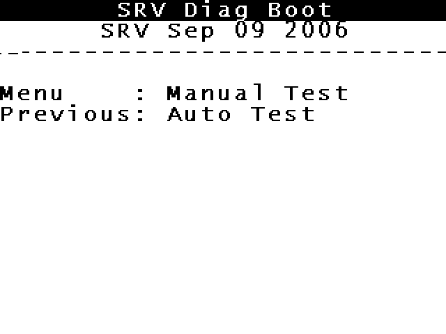

# The other four images in the flash

`osos` is not the only bootable thing this iPod has. The NOR carries a directory at `0xffe00` of
40-byte records, each tagged `flsh` (stored reversed, `hslf`), describing five images:

| tag | devOffset | length | load addr | entry | checksum |
|---|---|---|---|---|---|
| `disk` | `0x000d3bd0` | 180 784 | `0x10000000` | 0 | **valid** |
| `diag` | `0x000a2cb8` | 200 472 | `0x10000000` | 0 | **valid** |
| `scan` | `0x00089fdc` | 101 596 | `0x10000000` | 0 | **valid** |
| `logo` | `0x000879f8` | 9 700 | `0x10000000` | 0 | **valid** |
| `vmcs` | `0x0006ec98` | 101 728 | `0x10000000` | 0 | **valid** |

All five checksums verify as a plain byte sum. `disk`, `diag` and `scan` open with `ea000006` — an
ARM branch, so they are vector tables and therefore bootable. `logo` opens with `"LoGo"` and `vmcs`
with zeros; those are data.

**The contract is identical to `osos`**: a raw ARM image loaded at `0x10000000` and entered there.
So `tools/ipod-boot/flsh.sh` boots any of them exactly the way RetailOS is booted — and they are
two orders of magnitude smaller, 200 KB against 7.5 MB.

## Diagnostics boots, and then waits to be talked to

`diag` runs. It does **not** remap SDRAM to 0 the way `osos` and Rockbox do — it executes in place at
`0x1000xxxx` — and it stops here:

```
1000c6a0  ldr  r0, [pc, #-0x2ec]   ; 0xb0020000
1000c6a4  ldrh r0, [r0, #0x0]
1000c6a8  tst  r0, #0x1
1000c6ac  beq  0x1000c6a0
1000c6b0  ldr  r0, [pc, #-0x2f8]   ; 0xb0060000
1000c6b4  ldrh r0, [r0, #0x0]
      …
1000c6bc  beq  0x1000c6a0
```

**101 185 488 unmapped halfword reads of `0xb0020000`** from that one instruction, plus writes to
`0xb0030000`, and three related literals: `0xb0020000`, `0xb0040000`, `0xb0060000`. Nothing else in
this project touches `0xb00x0000`, and it appears in no register map we have — Rockbox's `pp5020.h`
included.

Supplying bit 0 of `0xb0020000` clears the first gate and it advances to the second, at
`0xb0060000`. That is a **two-register handshake**, and the shape — a ready bit, a second status, a
write port — is a UART.

> *Superseded 2026-08-19 — see "The device at `0xb0000000` is the VideoCore" at the foot of this
> page. It is not a UART and it is not a host waiting to talk: it is the **BCM2722**, at a second
> address, and the 184 320 bytes going out through it are the co-processor's own firmware. Mapping
> the chip there makes diagnostics draw. Everything above is also measured on the **prototype's**
> `diag`, which is a factory build; the retail ROM carries a different, smaller program.*

### Which makes it less useful than it first looked

> *Wrong, and wrong in an instructive way — retracted 2026-08-19. It is not waiting for a host, and
> the protocol was not unknown: it is the co-processor's own, already implemented in this
> repository, and the "other end of the conversation" was a decode we had not mapped. The hope
> below was right; it was reachable the whole time.*

The hope was that diagnostics would be Apple's own hardware test suite: same codebase family as
RetailOS, written to report what the hardware is doing, and small enough to read. It may still be
that. But it opens by **waiting for a host to talk to it**, not by testing anything, and the
protocol on that port is unknown. Driving it means inventing the other end of a conversation, which
is the same class of problem as synthesising BCM replies.

`scan` is the more promising of the three — a disk scanner has no obvious reason to need a host —
and it is untested. `disk` is USB mass storage, which this emulator does not model at all
([research/03](03-rtxc-and-the-video-coprocessor.md) §50), so it is the least promising.

## The flash is a prototype's, and its bootloader knows it

The dump's own Internet Archive metadata settles the provenance question:

```
title:    SA JULY 12 2007 ipod video prototype firmware dump
uploader: Elite Obsolete Electronics (email redacted)
date:     2007-07-12
```

Elite Obsolete Electronics — the same source as the board table in
[research/05](05-the-chip-inventory.md). So the placeholder serial `U1234567890`, the blank `HwId`
and the unpublished `HwVr = 0x000b0011` are all explained: **this is a prototype's flash.**

The obvious experiment is to patch `HwVr` to a published retail value and see whether RetailOS
behaves differently. It does not survive contact:

| `HwVr` in flash | bootloader reaches `Retail mode` | profile buckets |
|---|---|---|
| `0x000b0011` — as dumped | **yes**, loads `osos` | 6 033 |
| `0x000b0010` — published 5G | **no** | 449 |
| `0x000b0005` — published 5G | **no** | 448 |

**The prototype bootloader requires the prototype `HwVr`.** They are a matched pair: hand this ROM a
retail revision and it decides it is running on hardware it does not recognise, and never loads
`osos` at all. This is the third "it stopped failing because it never got there" of the
investigation, and it was caught the same way — by checking whether the bootloader still completed.

So the prototype hypothesis **cannot be tested one field at a time**. It needs a whole retail NOR,
bootloader and `SCfg` together. That remains the single highest-value artefact this project does not
have.

## A retail NOR — and the prototype was never the problem

The retail dump was **already in this repo, mislabelled**. `resources/vendor/ipod-bootrom-archive/`
files it under `A1238`, which is the iPod *classic* 6G's model number; the bytes say otherwise.

| field | prototype (ours) | retail dump |
|---|---|---|
| `SrNm` | `U1234567890` (placeholder) | **`<SERIAL-ROM>`** |
| `HwId` | `ff ff ff ff` (blank) | **`3a 76 01 82`** |
| `HwVr` | `0x000b0011` (unpublished) | **`0x000b0005`** (published retail 5G) |
| `Mod#` | `M8976` | `MA146` |

It is PP502x, not S5L: `PP5020`/`PP5022`/`PP5026` strings sit at byte-identical offsets to our
prototype, and every `flsh` load address is `0x10000000` (the archive's 3G dump uses `0x28000000`,
the PP5002 base — internally consistent). 511 827 bytes differ from the prototype, so it is a
genuinely separate device.

### It rejected our disk, correctly

Booting it against the existing image produced Apple's own multilingual restore screen —
*"Connect to your computer. Use iTunes to restore."* in four languages — and then `b .`. The retail
ROM validates what the prototype ROM waved through.

**Our firmware partition was inconsistent.** Its directory at partition+`0x4200` is a faithful copy
of `Firmware-20.6.3`'s, but the `osos` body had been *relocated* to partition+`0x1c200` by earlier
surgery and the directory never updated — so no image checksummed at the offset the directory
claimed. Writing the pristine 13 895 680-byte firmware over the partition (which it fits **exactly**)
makes `osos` and `rsrc` verify. `aupd` still does not, at any offset.

### Which is when it ran Apple's flash updater

With a consistent partition the retail ROM does not boot `osos` at all. It runs **`aupd`**:

```
Running 'aupd' 0 from 0x10000000
0> iPod CFI Flash Firmware update    offset 0x1C     size 0x2000
1> iPod CFI Flash Firmware update    offset 0x2038   size 0xF8000
84> updatePctOfTotal  : 42
END MARKER - VALID
Device Flash Version: FFFFFFFF     Update Flash Version: 0
```

299 frame updates of a white progress screen.

**This explains [research/04](04-bypass-ledger.md) #12.** That bypass removes the `aupd` directory
entry, and its stated reason was only *"the ROM halts after reading it"*. The real reason is now
visible: **with `aupd` present and the partition consistent, the bootloader runs the updater instead
of the OS.** The bypass is not a workaround for a halt, it is a workaround for a firmware update.

*(Two claims that stood here have been corrected below. `Device Flash Version: FFFFFFFF` is **not** a
CFI query returning nothing — it is a `vers` record lookup at flash `0x4040`, and it does not gate
anything. And `aupd` is **not** plainly executable ARM: `aupd.bin` measures 7.9998 bits of entropy
per byte and contains not one printable string, including the ones the updater demonstrably prints.
It is ciphertext, and the bootloader decrypts it — which is also why its body sums to `0x08299587`
against a directory that claims `0x0b19db1c`. The earlier reading of it as encrypted was right.)*

### And the answer to the question the whole exercise was for

With `aupd` removed, the retail ROM boots RetailOS — `Retail mode`, `Running 'osos' 0 from
0x10000000`, 59 DMA transfers.

| NOR | arrivals at `0x00000000` over 800 M at `--clock=5` |
|---|---|
| prototype | 103 |
| **retail** | **104** |

**The same loop, at the same rate, and the PMF fault at `0x000fb8a4` fires in both.** The prototype
flash — the placeholder serial, the blank `HwId`, the unpublished `HwVr` — is **not** the cause of
RetailOS's blocker.

That closes the largest remaining "maybe it isn't our fault" hypothesis, and it closes it with the
artefact the hypothesis demanded rather than by argument.

## The update runs, and it retires bypass #12 itself

`tools/ipod-boot/flash-update.sh` is the recipe. Retail ROM, `Firmware-20.6.3` written at the MBR's
own partition start so the `!ATA` directory is Apple's — `osos`, `rsrc` **and** `aupd`, nothing
removed — `--nor`, and `--disk-writable`. Two boots:

```
===== boot 1 =====                      ===== boot 2 =====
Running 'aupd' 0 from 0x10000000        Retail mode
0> iPod CFI Flash Firmware update       Running 'osos' 0 from 0x10000000
END MARKER - VALID
Device Flash Version: FFFFFFFF
```

24 ATA commands on the first boot, 96 on the second. Nothing is edited between them: **the updater
edits the disk.**

### The bypass was hand-applying the updater's own last write

The updater's final act is `WRITE SECTORS` (`0x30`) of one sector to **LBA 96** — the firmware
directory it was launched from — followed by `FLUSH CACHE` and `STANDBY IMMEDIATE`. It does not
delete the `aupd` entry; it sets the word at entry+`0x08` from 0 to 1, and the ROM then skips it.

That is exactly what the bypass was doing by hand. The disk carried a second, `aupd`-less copy of
the directory and the machine read that instead. **Read-only, the updater's own bookkeeping write
aborts and the machine updates on every boot forever** — so `--disk-writable` is as load-bearing as
the flash model.

### The ROM will not touch a flash it cannot name

`0x40009f88` — copied verbatim into `aupd` at `0x100051fc` — writes `0xAA`/`0x55`/`0x90` to `0xAAAA`
and `0x5554`, reads a manufacturer/device pair back, resets with `0xF0` then `0xFF`, and looks the
pair up in an eight-row table at flash+`0x1d0e0`. Against a plain memory region the "reply" is
whatever offset 0 holds: `0x1ffe` and `0xea00`, which is the reset branch `b 0x8000` read as two
IDs. No row matches, and the 40 command writes go nowhere.

The table is identical in both dumps. `0x40009eb8` reads its geometry as triples of
`(start, end, sector)` in **2 KiB units** from row+`0x18`, terminated by `0xffff`:

| row | mfr | dev | size | sectors | | 
|---|---|---|---|---|---|
| 0 | `0x00ec` | `0x22b2` | 1 MiB | uniform 64 KiB | Samsung |
| 1 | `0x0001` | `0x226b` | 1 MiB | 16/8/8/32K then 64 KiB | AMD — an AM29LV800B bottom-boot map, exactly |
| 2 | `0x0004` | `0x226b` | 1 MiB | same | Fujitsu |
| 3 | `0x00bf` | `0x273f` | 1 MiB | uniform 4 KiB | SST |
| 4 | `0x00bf` | `0x2781` | 1 MiB | uniform 4 KiB | SST — SST39VF800A |
| 5 | `0x00b0` | `0x0000` | 1 MiB | 8 KiB then 64 KiB | Sharp — **Intel** command set |
| 6 | `0x0020` | `0x0000` | 1 MiB | 8 KiB then 64 KiB | Intel/ST — Intel command set |
| 7 | `0x00bf` | `0x272f` | 512 KiB | uniform 4 KiB | SST |

Row 1's map decoding to a real AM29LV800B is the check that the format was read right, not guessed.

We answer as row 4. The dump is 1 MiB, which rules out row 7; of the six left it is the only
**uniform** geometry, so the sector the driver computes and the one we erase cannot disagree, and it
drives the AMD command set the probe already speaks. **Nothing in either dump records which part the
hardware carried** — this is a choice among the eight the ROM accepts, not a measurement.

### `Device Flash Version: FFFFFFFF` is not the blocker, and never was

It is not a CFI query. `0x100013e8` loads the literal `0x00004040`, reads the word there, and takes
the version only if it reads `'vers'`; our flash has a SysCfg `HwId` record at `0x4040` and its own
`'vers'` at `0x8040`, so the device version stays at its `mvn`-initialised `0xFFFFFFFF`. The update
version comes out 0 the same way. The caller keeps the result in `r8` and **proceeds either way** —
`r8` only picks between two arms at `0x100037ec`, and a mismatch selects the *write* arm.

A full 1 MiB reflash issues the CFI query command `0x98` exactly **zero** times. The model answers
one anyway, because the driver object calls itself `Cfi!` and a part that answers autoselect but not
a query is not a part.

### What actually decides: the flash already matched

`0x10001534` walks the record word by word against the flash and returns "identical", and the caller
skips the write. That is not a failure — it is correct. The `aupd` payload in `Firmware-20.6.3` is
**byte-identical to the retail NOR dump** over both regions it would write:

| record | source | destination | size | vs retail dump | vs prototype dump |
|---|---|---|---|---|---|
| 0 | payload+`0x1c` | flash `0x0` | `0x2000` | **0 bytes differ** | 0 bytes differ |
| 1 | payload+`0x2038` | flash `0x8000` | `0xf8000` | **0 bytes differ** | 511 793 differ |

So the retail device is already carrying exactly this firmware, and the authentic outcome is a
no-op followed by the bookkeeping write. `arg0` is the flash destination and `offset` the source
within the payload — the second record covers `0x8000`..`0x100000`, which is the bootloader image.

### Proving the erase and program paths, since the real update declines to use them

Perturb 64 bytes at `0xc0000` in a scratch copy of the retail ROM — inside the `diag` image, which
the boot never executes, and inside record 1's span — and the updater stops declining:

```
nor: 248 sector erases, 507904 words programmed
  cycle 0x30 sector erase   x248        cycle 0xa0 program setup  x507904
  cycle 0x80 erase setup    x248        cycle 0xaa unlock         x508406
  cycle 0x90 autoselect     x6          cycle 0xf0 reset          x255
```

Every number checks against another: 248 = `0xf8000`/4 KiB, 507 904 = `0xf8000`/2 words, and
508 406 unlocks = 507 904 programs + 2×248 erases + 6 identifies. **The flash afterwards is
byte-identical to the pristine retail dump** — the model repaired all 64 perturbed bytes and touched
nothing else.

That run also found a bug in the model, by a route worth recording: the first version tallied every
bus cycle as a command, and the report showed `reset (Intel) x281612` beside a program count less
than half the size of the transfer. A program's *data* cycle is data — a real part latches whatever
is on the bus — and decoding it was swallowing every payload word whose low byte was `0xff`. A
report that only counted erases and programs would have shown 225 130 words written and looked fine.

### The prototype ROM still refuses, and #12 stays open there

`cold-boot.sh` runs the prototype dump, and that ROM reads its firmware partition at **4× the MBR
LBA** — LBA 252 and 284 where the retail ROM reads 63 and 96, in 2 KiB blocks against 512-byte ones.
That is why `ipod8g.img` carries two firmware copies: one at `0x7e00` for the retail ROM and a
hand-built one at `0x1f800` for the prototype, and it is the second one that had `aupd` removed.

Put `aupd` back in that copy, with its body at the block the ROM actually reads (`partition`+
`0xc3a800`, LBA 25296 — measured, not derived), and the prototype ROM reads all 2 104 sectors of the
image and then runs an orderly power-off: `0x40006138` → `0x40003984` → `0x4000159c`, `b .`, without
printing a line. It never enters the image and never prints `Running 'aupd'`. Not diagnosed further.
The plausible reading is that the prototype bootloader cannot decrypt this payload — it is the same
matched-pair behaviour as the `HwVr` result above — but that is a hypothesis, not a measurement.

## The prototype ROM was the blocker, and the retail one was in the repo all along

*2026-08-13. This section supersedes the working assumption that the prototype NOR was a curiosity
rather than a constraint.*

`cold-boot.sh` has defaulted to the prototype dump since the day it was written, for no reason
beyond it being the first one downloaded. Measured on the same day, same budget, same emulator, the
two configurations are not close:

| 600 M instructions, `--clock=5` | prototype NOR + `ipod8g.img` | retail NOR + `ipod8g-retail.img` |
|---|---|---|
| arrivals at address `0` | **314** — 157 self-resets | **2** — the cold reset and the bootloader handoff |
| unmapped accesses | 640 reads at `0xea000078` | **none at all** |
| ATA commands | 77 | **96** |
| ATA DMA | 60 transfers, 7 596 032 B | **72 transfers, 8 113 664 B** |
| irqs asserted | 183 412 | 512 901 |
| reads `rsrc` | never | **yes** |

### The retail path mounts `rsrc` and loads the VideoCore firmware

Its post-handover command sequence, with the LBAs resolved against the volume inventory above:

```
[76] READ DMA 64 sectors  lba 0        MBR
[77]                      lba 32768
[78]                      lba 0
[79]                      lba 64
[80]                      lba 14864    <- the rsrc FAT boot sector, exactly
[81]                      lba 22429    <- RenderServer.bin  (starts 22425)
[82]                      lba 14870    <- the FAT itself
[83]                      lba 22645    <- vmcs.bin          (starts 22633, 99 clusters)
[84] 126 sectors          lba 22646
[85..88]                  lba 22772..22902   more of vmcs.bin
[89]                      lba 23028    <- aacdec.vll        (starts 23033)
[90] STANDBY IMMEDIATE                 <- spins the drive down
```

Mount the volume, walk the FAT, load the co-processor's firmware and its first codec, then park the
disk. That is what a shipping iPod does at boot, and **it is bypass #6's retirement path executing
by itself** — `vmcs.bin` and `RenderServer.bin` are being read off the disk by Apple's own code,
with no help from us.

Two things this settles at once:

- **The 157 self-resets are prototype-only.** They are `BX` to address zero through a null `this`
  (research/10 Addendum 5), and the null comes from a font registry that has nothing in it because
  `rsrc` was never mounted. On the retail path the volume *is* mounted, and the reset does not
  happen. The chain in research/10 §§1–8 is correct and was diagnosing a downstream symptom of the
  wrong bootloader.
- **`0xea000078` was never a real address.** It is RetailOS's own reset-vector word, `b 0x1f0`,
  being read as a vtable base. It appears in exactly the runs that take the null dispatch, which is
  to say the prototype's.

### Why the recipes stay separate

`retail-boot.sh` is a new recipe rather than a change to `cold-boot.sh`'s defaults, so that every
number already recorded in `research/` stays attributable to the configuration it was measured on.
**New work should use `retail-boot.sh`.** The prototype recipe is now the special case — kept
because bypass #12 is still open on that ROM, and because a prototype/retail diff is itself
evidence.

One caution, recorded because it nearly shipped: the first `retail-boot.sh` set `FLASH` and `DISK`
with `: "${VAR:=...}"` and `exec`'d the cold recipe. Plain shell assignment is not exported, so
`exec` passed neither, and the wrapper **silently ran the prototype configuration it exists to
avoid** — printing a plausible, entirely wrong 77-command run. Caught only by diffing its output
against the manual invocation. A recipe is an instrument, and instruments get verified.

---

## The same failure again, in the recipe below it: `flsh` was running the prototype's images

**Measured 2026-08-19.** The caution that closes the section above — *a recipe is an instrument, and
instruments get verified* — applies to the recipe on this page, and it had not been.

`ipod-boot flsh` read its image from `resources/derived/fw/flsh/$IMG.bin`: files extracted **once**,
from the prototype dump, and then handed to every run whatever `FLASH=` pointed at. So the retail
recipe ran the retail boot ROM with the *prototype's* diagnostics, reported it as a measurement of
the configured machine, and never once executed the diagnostics that is actually in the retail ROM.

It is not the same program. The two directories do not even hold the same set:

| tag | prototype dump | retail dump |
|---|---|---|
| `disk` | 180 784 | 180 784 |
| `diag` | **200 472** | **97 832** |
| `scan` | 101 596 | **absent** |
| `logo` | 9 700 | 9 700 |
| `vmcs` | 101 728 | 96 384 |

The prototype's `diag` is a **factory** build — `New Audio Test`, `Line In RecordM`, `M25 pin Test`,
`VC02 self Test`, `SDRAM 12 Hours Test`, `GotoFA`. The retail one is the **service diagnostic** any
owner can reach from the boot key combination, built `Sep 09 2006`, and it opens by printing its own
banner:

```
iPod Diagnostics
Diag %s %s
SRV Diag Boot
----------------------------
Menu    : Manual Test
Previous: Auto Test
```

with the menu tree under it: `AutoTest`, `Memory` → `SDRAM` / `Flash`, `Comms` → `Wheel` / `Display`
/ `TVOUT`, `HardDrive` → `HDSpecs` / `HDSMARTData`, `Power` → `A2DTests` / `Sleep`, `SysCfg`.

`inspect::nor_images` / `inspect::nor_image` now cut the image out of the dump under test on every
run, and `IMG=scan` against a retail ROM says so instead of quietly substituting somebody else's:

```
$ IMG=scan ipod-boot flsh
ipod-boot flsh: …retail_5g_MA146….bin carries no `scan` image. It has: disk · diag · logo · vmcs
```

## The device at `0xb0000000` is the VideoCore, and diagnostics now draws

The reading above — *"the shape is a UART"* — was a guess from two registers. It is the **BCM2722
VideoCore**: the same co-processor this emulator has modelled since the beginning, at a second
address.

**Apple's own code names it.** Both `diag` images carry the assert-path string of the driver:

```
retail    0x10016384   D:\workspace\may\RMA\M25B_Intro_RMA\service diag\drivers\vchost.c
prototype 0x1000c344   D:\RMA\M25B_Intro_RMA\intro-07-06-15\Drivers\vchost.c
```

`vchost` — VideoCore host port — and the file it pushes through that port is named a few hundred
bytes away, in 8.3 form: **`VMCS    BIN`**, which is `flsh/vmcs.bin`, the co-processor's firmware.

Set beside Rockbox's `firmware/target/arm/ipod/video/lcd-video.c`, the register map is not similar,
it is **the same map at a different base**:

| Rockbox, at `0x30000000` | `diag`, at `0xb0000000` | role |
|---|---|---|
| `BCM_DATA` `+0x00000` | `+0x00000` | data FIFO |
| `BCM_WR_ADDR` `+0x10000` | `+0x10000` | write address — the "discarded read" is Rockbox's own `(void)BCM_WR_ADDR` |
| `BCM_RD_ADDR` `+0x20000` | `+0x20000` | read address. Not a command port: the 32-bit value is a **VideoCore-internal address**, written as two halfwords |
| `BCM_CONTROL` `+0x30000` | `+0x30000` | status/control |
| `BCM_ALT_*` `+0x40000…` | `+0x40000…` | the second host **channel**, not a second device |

Rockbox's own comment explains the stride: *"the 3 BCM address bits are mapped to address bits
16..18 of the PP5022"*. And the eight bytes `diag` writes to `CONTROL` —
`a1 81 91 02 12 22 72 62` — are `bcm_bootstrapdata[]` in `lcd-video.c:533`, byte for byte, followed
by the same five to `ALT_CONTROL`. The command encoding matches too: `1000ebe0 mvn r0, r4` /
`1000ebe4 orr r0, r4, r0, lsl #16` is `BCM_CMD(x) = (~x << 16) | x`.

So the 184 320-byte stream out of `0x11000000` is the **VMCS firmware upload**, and what follows it
is the co-processor's boot handshake — `bcm_write32(BCMA_COMMAND, 0)`, poke `0x10000C00`, poll bit 0,
write `0xA5A50002` to `0x10000400`, wait for `COMMAND` to go non-zero. That is `lcd-video.c:583-595`,
step for step. (`0x2d000` is a fixed over-read: it exceeds both `vmcs.bin` sizes, and harmlessly,
because the chip loads linearly from its SRAM address 0 and only needs the leading image.)

### So it was never a missing device — it was a missing decode

The model needed no new protocol. `Bcm` already answers every one of those registers correctly;
it was simply mapped at one address and Apple's diagnostics drives it at the other. `Bcm::alias`
maps the same chip at both, and **`diag` draws**:

```
bcm: 8 commands kicked, 8 frame updates
bcm framebuffer -> 320x240 from 0x000e0000, 70 669 non-black pixels
unmapped: 0 reads, 4 writes across 1 page
```



> `SRV Diag Boot` · `SRV Sep 09 2006` · `Menu : Manual Test` · `Previous: Auto Test`

**What is measured and what is not.** Measured: the driver strings, the identical register map, the
identical bootstrap bytes, the identical command encoding, the identical boot handshake, and the run
above. **Not measured:** *why* the chip answers at two addresses. `diag` writes `0x98016460` to
`0x70000030` — a register inside the PP502x external-bus block, and one this project has never been
able to name ([research/04](04-bypass-ledger.md) #1) — immediately before its first access, so it
may be switching the decode rather than using a permanent alias. It makes no difference to anything
that runs here: `diag` is the only program in Apple's software that touches the second window, and
it never touches the first.

The control for the alias is that it cannot move an existing number. A retail cold boot reports
**zero** accesses anywhere in `0xb0000000..0xb0080000`, and its fingerprint is unchanged — `Retail
mode`, `Running 'osos' 0 from 0x10000000`, 102 ATA commands, 20 127 code buckets.

### Which also settles what `diag` does *not* reference

| image | references `0x30000000` |
|---|---|
| `disk` (both dumps) | **yes** |
| `scan` (prototype) | **yes** |
| `diag` (**both** dumps) | **no** — not as a literal, not as an immediate |

That was the measurement that found the second window: `diag` obviously draws, and it demonstrably
does not draw through the address everything else uses.

It also has a consequence for [research/03](03-rtxc-and-the-video-coprocessor.md) §10, which
publishes a 320×240 frame of Apple's four-language *"Connect to your computer. Use iTunes to
restore."* screen under the heading *"Apple's firmware rendering through Apple's video
co-processor"* and attributes it to `diag`. **`diag` cannot have drawn it**, because at the time
that frame was captured the co-processor was mapped only at `0x30000000` and `diag` never writes
there. The message is disk mode's, `disk` does reference that address, and §12 of the same note
disassembles the halt it found at `0x400015b4` — an address in the NOR bootloader, not in an image
loaded at `0x10000000`. The frame is real and the decode is right; the attribution is wrong.

### Apple's diagnostics switches on `HwVr`, and `0x000B0010` is one of its three cases

At prototype `diag` `0x10003c28`, three cases in a row, each reading the hardware version through a
pointer and comparing a full word:

```asm
10003c28  sub  r12, r0, #0xb0000
10003c2c  subs r12, r12, #0x5      ; 0x000B0005 -> bl 0x10016888
10003c44  subs r12, r12, #0x10     ; 0x000B0010 -> bl 0x10015e74
10003c60  subs r12, r12, #0x11     ; 0x000B0011 -> bl 0x100158b4
```

[research/17](17-the-boot-matrix.md) records `0x000B0010` as *published, uncited, never measured* —
the 5.5G value this project carries on the strength of a wiki page and a comment. It is now also
**a first-class case in Apple's own on-device code**, beside the 5G's `0x000B0005` and the
prototype's `0x000B0011`, each with its own handler. That is a second independent occurrence in
Apple software (the first being `CIpodDevice::GetDeviceType()` in iTunes), and it settles that the
value is Apple-recognised.

It still does not measure *which revision* it belongs to — no retail 5.5G NOR has been read. But the
three-way split matches the three hardware revisions exactly, and the prototype is the one we can
check: its own `HwVr` is `0x000B0011`, and it is the third case.

### And it can be driven — the press has to outlast Apple's poll

Drawing was half of it. `diag`'s main loop is:

```asm
10009e7c  bl 0x10008914      ; read the button byte at 0x1001aa9c, clear it
10009e88  ldr r0, =0x249f0   ; 150 000 us
10009e8c  bl 0x100038e4      ; sleep
```

**One button read every 150 ms**, which at the real clock is 11.25 M instructions. `--wheel`'s
`press=` expands to a down/up pair `--wheel-click-instr` apart — 20 000 by default, **0.27 ms** —
so every press this project sent fell between two polls.

And it did not look like a missed press. `--storeaddr=0x1001aa9c` shows the interrupt handler
recording it perfectly:

```
0x000085f8 -> [0x1001aa9c] = 0x00000010   @422000160    <- MENU down
0x00008668 -> [0x1001aa9c] = 0x00000030   @422000173    <- MENU + wheel touched
0x00008668 -> [0x1001aa9c] = 0x00000020   @422020131    <- MENU up, 20 000 later
0x10008928 -> [0x1001aa9c] = 0x00000000   @432502227    <- the poll, 10 M later, reads 0x20
```

The button arrived, was overwritten by its own release, and the poll read the release. Held for
25 M instructions instead, the same press opens the menu.

So the tour is a script of explicit `down=`/`up=` pairs, and it walks: `SRV Diag Boot` → the
manual-test menu (`NTF · Memory · IO · Power · Accessories Test · SysCfg · Reset`) → `Memory`
(`SDRAM · Flash`) → `IO` (`Comms · Wheel · Display · HeadphoneDetect · HardDrive`) → `Wheel`
(`KeyTest · WheelTest`) → **Key Test**, which lists the five keys and blacks each one out as it is
pressed, ending on `KEY PASS`.

`ipod-film asset diag` is that tour, and the calibration lives in the code beside it.

**One screen is deliberately not filmed: `SysCfg`.** It prints the identity block out of the boot
ROM, which on a real dump is a real person's serial number and FireWire GUID. Every other screen
here is Apple's own text.
